# Supported Flows

This document provides a comprehensive overview of all user workflows supported
by the pls (prompt-language-shell) command-line concierge.

## Table of Contents

1. [Initial Configuration Flow](#initial-configuration-flow)
2. [Command Execution Flow](#command-execution-flow)
3. [Planning Flow](#planning-flow)
4. [Plan Selection and Refinement Flow](#plan-selection-and-refinement-flow)
5. [Task Execution Flows](#task-execution-flows)
6. [Configuration Validation Flow](#configuration-validation-flow)
7. [Skills System Flow](#skills-system-flow)
8. [Error Handling Flow](#error-handling-flow)
9. [Abort and Cancellation Flow](#abort-and-cancellation-flow)

---

## Initial Configuration Flow

**Trigger:** User runs `pls` for the first time or configuration is missing

**Flow:**

1. Application starts (src/index.tsx:36)
2. Main component checks for valid Anthropic API key (src/ui/Main.tsx:51-55)
3. If no valid configuration exists:
   - Display welcome screen (ComponentName.Welcome)
   - Show configuration required message (ComponentName.Message)
   - Display configuration component (ComponentName.Config)
4. User provides configuration values:
   - Anthropic API key
   - Model selection (with validation)
5. Configuration is saved to ~/.plsrc (src/handlers/config.ts:48)
6. AnthropicService is created with new configuration (src/handlers/config.ts:49)
7. Success feedback is displayed (ComponentName.Feedback)
8. If command was provided, proceed to command execution
9. Otherwise, exit gracefully

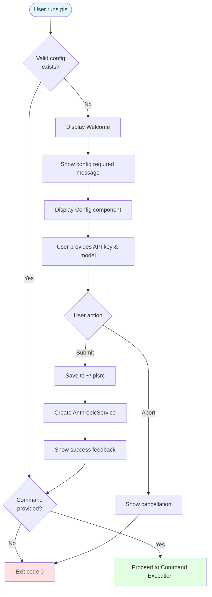
```mermaid
flowchart TD
    Start([User runs pls]) --> CheckConfig{Valid config<br/>exists?}
    CheckConfig -->|No| ShowWelcome[Display Welcome]
    CheckConfig -->|Yes| HasCommand{Command<br/>provided?}

    ShowWelcome --> ShowMessage[Show config required message]
    ShowMessage --> ConfigComp[Display Config component]
    ConfigComp --> UserInput[User provides API key & model]
    UserInput --> UserAction{User action}

    UserAction -->|Abort| AbortMsg[Show cancellation]
    UserAction -->|Submit| SaveConfig[Save to ~/.plsrc]

    SaveConfig --> CreateService[Create AnthropicService]
    CreateService --> ShowSuccess[Show success feedback]
    ShowSuccess --> HasCommand

    HasCommand -->|Yes| ExecCmd[Proceed to Command Execution]
    HasCommand -->|No| ExitApp[Exit code 0]

    AbortMsg --> ExitApp

    style Start fill:#e1f5ff
    style ExitApp fill:#ffe1e1
    style ExecCmd fill:#e1ffe1
```

**Key Files:**
- src/ui/Main.tsx:181-214
- src/handlers/config.ts:46-84
- src/ui/Config.tsx

**Exit Points:**
- Configuration completed → Continue to command execution or exit
- User aborts → Application exits with code 0

---

## Command Execution Flow

**Trigger:** User runs `pls <command>` or completes initial configuration

**Flow:**

1. User provides natural language command
2. Main component creates Command definition (src/ui/Main.tsx:186-192)
3. Command component calls LLM with PLAN tool (src/ui/Command.tsx)
4. LLM processes request and returns:
   - Message introducing the plan
   - List of structured tasks with actions, types, and parameters
5. Command handler receives response (src/handlers/command.ts:32)
6. Handler analyzes task list:
   - If contains DEFINE tasks → Show plan and await user selection
   - If all tasks are concrete → Show plan with confirmation
7. Proceed to appropriate next flow

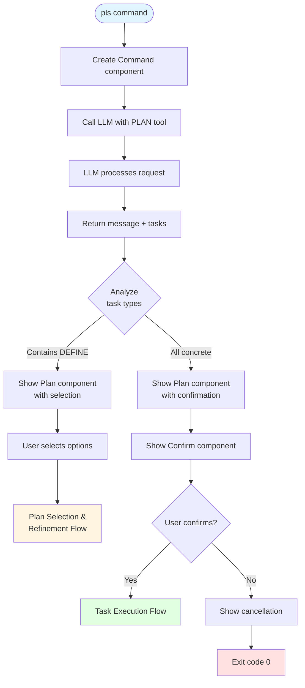
```mermaid
flowchart TD
    Start([pls command]) --> CreateCmd[Create Command component]
    CreateCmd --> CallLLM[Call LLM with PLAN tool]
    CallLLM --> ProcessReq[LLM processes request]
    ProcessReq --> ReturnPlan[Return message + tasks]

    ReturnPlan --> AnalyzeTasks{Analyze<br/>task types}

    AnalyzeTasks -->|Contains DEFINE| ShowPlanSelect[Show Plan component<br/>with selection]
    AnalyzeTasks -->|All concrete| ShowPlanConf[Show Plan component<br/>with confirmation]

    ShowPlanSelect --> UserSelect[User selects options]
    UserSelect --> Refinement[Plan Selection &<br/>Refinement Flow]

    ShowPlanConf --> Confirm[Show Confirm component]
    Confirm --> UserConfirm{User confirms?}

    UserConfirm -->|Yes| ExecFlow[Task Execution Flow]
    UserConfirm -->|No| Cancel[Show cancellation]

    Cancel --> Exit[Exit code 0]

    style Start fill:#e1f5ff
    style Refinement fill:#fff5e1
    style ExecFlow fill:#e1ffe1
    style Exit fill:#ffe1e1
```

**Key Files:**
- src/ui/Command.tsx
- src/handlers/command.ts:20-78
- src/config/PLAN.md (LLM instructions)

**Exit Points:**
- User confirms plan → Proceed to execution flow
- User cancels → Display cancellation message and exit
- Error occurs → Display error and exit

---

## Planning Flow

**Trigger:** Command component processes user request

**Purpose:** Transform natural language into structured task definitions

**Flow:**

1. LLM receives user request and available skills (if any)
2. LLM analyzes request type:
   - **Introspection request** → Create task with type "introspect"
   - **Information request** → Create task with type "answer"
   - **Configuration request** → Create task with type "config"
   - **Skill-based request** → Match to available skills
   - **Ambiguous request** → Create task with type "define"
   - **Unmatched request** → Create task with type "ignore"
3. For skill-based requests:
   - Check if skill requires parameters (e.g., {TARGET}, {ENV})
   - If variant specified → Extract steps from skill's Execution section
   - If variant not specified → Create "define" task with options
   - Replace all placeholders with actual values
   - Create task for each step with params.skill and params.variant
4. LLM returns structured response:
   - Introductory message (max 64 chars, ends with period)
   - Array of task definitions with action, type, and params
5. Tasks validated for uniqueness and clarity

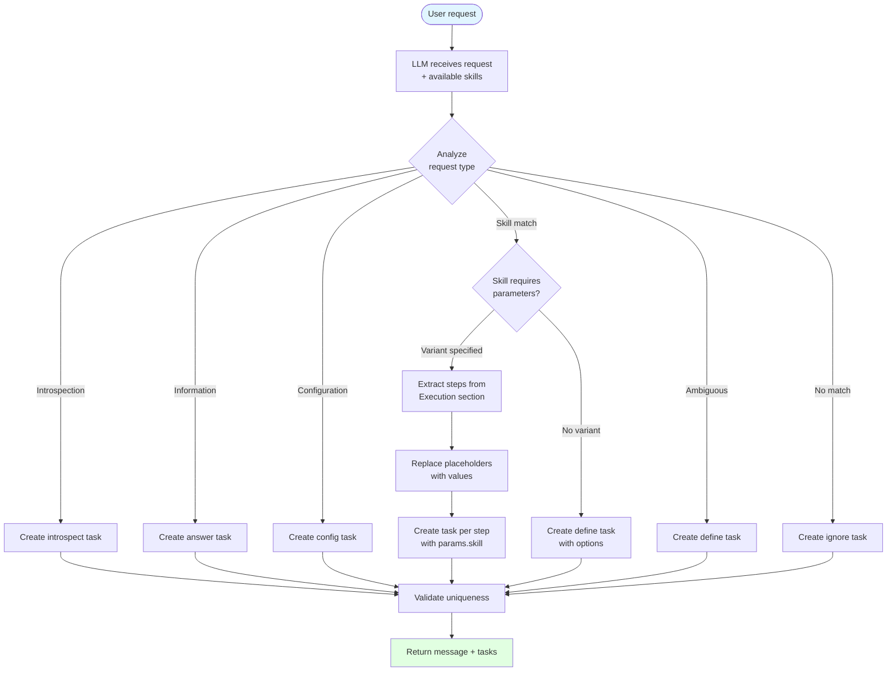
```mermaid
flowchart TD
    Start([User request]) --> ReceiveReq[LLM receives request<br/>+ available skills]
    ReceiveReq --> Analyze{Analyze<br/>request type}

    Analyze -->|Introspection| CreateIntrospect[Create introspect task]
    Analyze -->|Information| CreateAnswer[Create answer task]
    Analyze -->|Configuration| CreateConfig[Create config task]
    Analyze -->|Skill match| CheckSkill{Skill requires<br/>parameters?}
    Analyze -->|Ambiguous| CreateDefine[Create define task]
    Analyze -->|No match| CreateIgnore[Create ignore task]

    CheckSkill -->|Variant specified| ExtractSteps[Extract steps from<br/>Execution section]
    CheckSkill -->|No variant| CreateDefineOpts[Create define task<br/>with options]

    ExtractSteps --> ReplacePlaceholders[Replace placeholders<br/>with values]
    ReplacePlaceholders --> CreateTasks[Create task per step<br/>with params.skill]

    CreateIntrospect --> Validate
    CreateAnswer --> Validate
    CreateConfig --> Validate
    CreateTasks --> Validate
    CreateDefineOpts --> Validate
    CreateDefine --> Validate
    CreateIgnore --> Validate

    Validate[Validate uniqueness] --> Return[Return message + tasks]

    style Start fill:#e1f5ff
    style Return fill:#e1ffe1
```

**Key Files:**
- src/config/PLAN.md (comprehensive planning instructions)
- src/services/anthropic.ts (LLM service)
- src/types/types.ts:26-37 (TaskType enum)

**Task Types:**
- `config` - Configuration changes, settings updates
- `plan` - Planning or breaking down tasks
- `execute` - Shell commands, running programs, processing operations
- `answer` - Answering questions, providing information
- `introspect` - Listing capabilities and skills
- `report` - Generating summaries, displaying results
- `define` - Presenting options when request is ambiguous
- `ignore` - Request too vague or no matching skill

**Exit Points:**
- Valid plan created → Display plan to user
- Error parsing response → Error handling flow

---

## Plan Selection and Refinement Flow

**Trigger:** Plan contains one or more DEFINE tasks

**Flow:**

1. Plan component displays DEFINE task(s) (ComponentName.Plan)
2. User navigates options using keyboard:
   - Up/Down arrows to highlight options
   - Enter to select highlighted option
   - Ctrl+C to abort
3. User selects an option for each DEFINE task
4. Refinement component shows "refining plan" message
   (ComponentName.Refinement)
5. Selected tasks sent to LLM for plan refinement
   (src/handlers/plan.ts:62-83)
6. LLM generates refined plan with concrete tasks
7. New plan displayed with confirmation prompt
8. User confirms or cancels execution

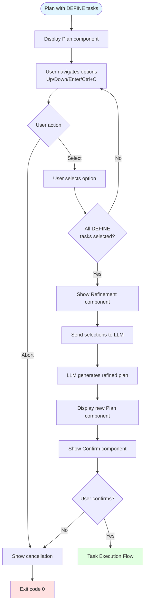
```mermaid
flowchart TD
    Start([Plan with DEFINE tasks]) --> DisplayPlan[Display Plan component]
    DisplayPlan --> UserNav[User navigates options<br/>Up/Down/Enter/Ctrl+C]

    UserNav --> UserAction{User action}
    UserAction -->|Abort| ShowCancel[Show cancellation]
    UserAction -->|Select| SelectOpt[User selects option]

    SelectOpt --> AllSelected{All DEFINE<br/>tasks selected?}
    AllSelected -->|No| UserNav
    AllSelected -->|Yes| ShowRefine[Show Refinement component]

    ShowRefine --> SendToLLM[Send selections to LLM]
    SendToLLM --> LLMRefine[LLM generates refined plan]
    LLMRefine --> DisplayNew[Display new Plan component]

    DisplayNew --> ShowConfirm[Show Confirm component]
    ShowConfirm --> UserConfirm{User confirms?}

    UserConfirm -->|Yes| ExecFlow[Task Execution Flow]
    UserConfirm -->|No| ShowCancel

    ShowCancel --> Exit[Exit code 0]

    style Start fill:#e1f5ff
    style ExecFlow fill:#e1ffe1
    style Exit fill:#ffe1e1
```

**Key Files:**
- src/ui/Plan.tsx (interactive selection)
- src/handlers/plan.ts:47-139 (selection handling)
- src/ui/Refinement.tsx (refinement indicator)

**Exit Points:**
- User confirms refined plan → Proceed to execution flow
- User cancels → Display cancellation and exit
- Error during refinement → Error handling flow

---

## Task Execution Flows

### Overview

After plan confirmation, tasks are routed to appropriate handlers based on type.

**Routing Logic** (src/handlers/execution.ts:50-250):

1. Confirm component completes (ComponentName.Confirm)
2. Execution handler analyzes task types:
   - All introspect → Introspection flow
   - All answer → Answer flow
   - All config → Config flow
   - All execute → Execute flow (with optional validation)
   - Mixed types → Error (not supported)
3. Route to appropriate handler

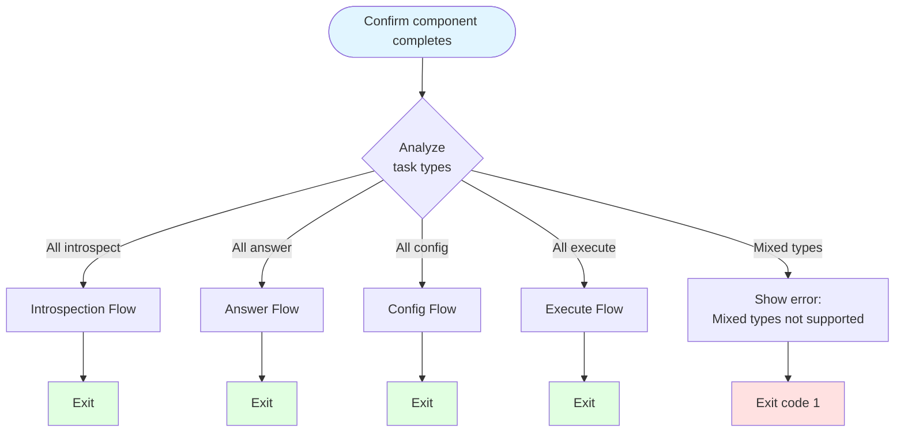
```mermaid
flowchart TD
    Start([Confirm component completes]) --> AnalyzeTypes{Analyze<br/>task types}

    AnalyzeTypes -->|All introspect| IntrospectFlow[Introspection Flow]
    AnalyzeTypes -->|All answer| AnswerFlow[Answer Flow]
    AnalyzeTypes -->|All config| ConfigFlow[Config Flow]
    AnalyzeTypes -->|All execute| ExecuteFlow[Execute Flow]
    AnalyzeTypes -->|Mixed types| ShowError[Show error:<br/>Mixed types not supported]

    IntrospectFlow --> Exit1[Exit]
    AnswerFlow --> Exit2[Exit]
    ConfigFlow --> Exit3[Exit]
    ExecuteFlow --> Exit4[Exit]
    ShowError --> ExitErr[Exit code 1]

    style Start fill:#e1f5ff
    style Exit1 fill:#e1ffe1
    style Exit2 fill:#e1ffe1
    style Exit3 fill:#e1ffe1
    style Exit4 fill:#e1ffe1
    style ExitErr fill:#ffe1e1
```

---

### Introspection Flow

**Trigger:** All tasks have type "introspect"

**Flow:**

1. Create Introspect component (ComponentName.Introspect)
2. Component calls LLM with INTROSPECT tool (src/ui/Introspect.tsx)
3. LLM analyzes available capabilities:
   - Built-in capabilities (introspect, answer, config, execute)
   - User-defined skills from ~/.pls/skills/
4. LLM generates:
   - Introductory message
   - List of capabilities with descriptions
   - Marks built-in vs user-defined skills
5. Report component displays results (ComponentName.Report)
6. Application exits

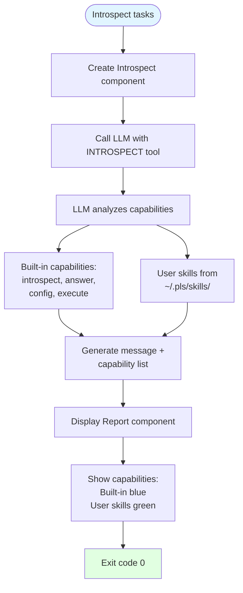
```mermaid
flowchart TD
    Start([Introspect tasks]) --> CreateComp[Create Introspect component]
    CreateComp --> CallLLM[Call LLM with INTROSPECT tool]
    CallLLM --> Analyze[LLM analyzes capabilities]

    Analyze --> BuiltIn[Built-in capabilities:<br/>introspect, answer,<br/>config, execute]
    Analyze --> Skills[User skills from<br/>~/.pls/skills/]

    BuiltIn --> Generate
    Skills --> Generate

    Generate[Generate message +<br/>capability list] --> DisplayReport[Display Report component]
    DisplayReport --> ShowList[Show capabilities:<br/>Built-in blue<br/>User skills green]
    ShowList --> Exit[Exit code 0]

    style Start fill:#e1f5ff
    style Exit fill:#e1ffe1
```

**Key Files:**
- src/ui/Introspect.tsx
- src/handlers/introspect.ts
- src/config/INTROSPECT.md (LLM instructions)
- src/ui/Report.tsx

**Output:**
- Capabilities listed with names and descriptions
- Built-in capabilities shown in blue
- User-defined skills shown in green

---

### Answer Flow

**Trigger:** All tasks have type "answer"

**Flow:**

1. Extract question from first task's action field
2. Create Answer component (ComponentName.Answer)
3. Component performs web search for the question (src/ui/Answer.tsx)
4. Search results analyzed and answer synthesized
5. Answer displayed with AnswerDisplay component
   (ComponentName.AnswerDisplay)
6. Application exits

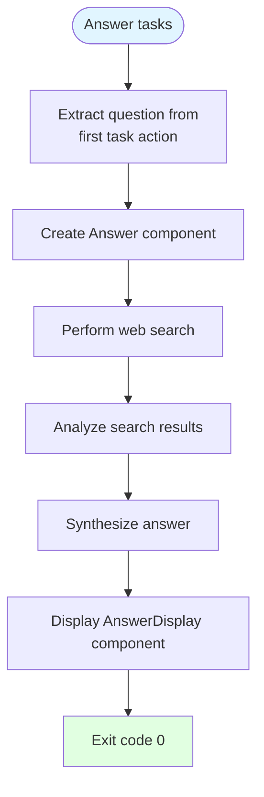
```mermaid
flowchart TD
    Start([Answer tasks]) --> Extract[Extract question from<br/>first task action]
    Extract --> CreateComp[Create Answer component]
    CreateComp --> WebSearch[Perform web search]
    WebSearch --> Analyze[Analyze search results]
    Analyze --> Synthesize[Synthesize answer]
    Synthesize --> Display[Display AnswerDisplay component]
    Display --> Exit[Exit code 0]

    style Start fill:#e1f5ff
    style Exit fill:#e1ffe1
```

**Key Files:**
- src/ui/Answer.tsx
- src/handlers/answer.ts
- src/ui/AnswerDisplay.tsx

**Notes:**
- Only processes first task (single question)
- Uses web search for current information
- Answer formatted and displayed to user

---

### Config Flow

**Trigger:** All tasks have type "config"

**Flow:**

1. Extract config keys from task parameters
2. Create Config component with required keys (ComponentName.Config)
3. User provides values for each configuration key:
   - Text input for most fields
   - Validation applied per field
4. Config component collects all values (src/ui/Config.tsx)
5. Values saved to appropriate section in ~/.plsrc
   (src/handlers/config.ts:97-165)
6. Success feedback displayed
7. If part of execution flow, resume with Execute component
8. Otherwise, exit

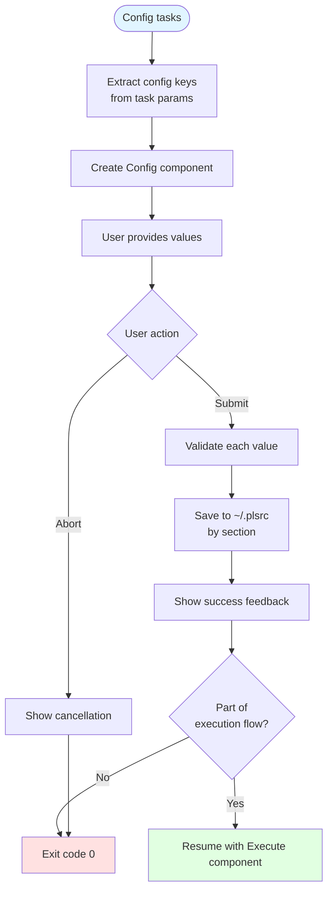
```mermaid
flowchart TD
    Start([Config tasks]) --> ExtractKeys[Extract config keys<br/>from task params]
    ExtractKeys --> CreateComp[Create Config component]
    CreateComp --> UserInput[User provides values]

    UserInput --> UserAction{User action}
    UserAction -->|Abort| ShowCancel[Show cancellation]
    UserAction -->|Submit| Validate[Validate each value]

    Validate --> SaveConfig[Save to ~/.plsrc<br/>by section]
    SaveConfig --> ShowSuccess[Show success feedback]

    ShowSuccess --> PartOfExec{Part of<br/>execution flow?}
    PartOfExec -->|Yes| ResumeExec[Resume with Execute component]
    PartOfExec -->|No| Exit[Exit code 0]

    ShowCancel --> Exit

    style Start fill:#e1f5ff
    style ResumeExec fill:#e1ffe1
    style Exit fill:#ffe1e1
```

**Key Files:**
- src/ui/Config.tsx
- src/handlers/config.ts:93-190
- src/services/configuration.ts (save operations)

**Configuration Structure:**
- Nested YAML in ~/.plsrc
- Grouped by top-level sections
- Supports dot-notation paths (e.g., product.alpha.path)

---

### Execute Flow

**Trigger:** All tasks have type "execute"

**Flow:**

1. **Validation Phase:**
   - Validator checks tasks for config placeholders
     (src/services/execution-validator.ts)
   - Extracts required config paths from task actions
   - Checks if paths exist in ~/.plsrc
   - If missing config found → Configuration Validation Flow
   - If all config present → Continue to execution

2. **Execution Phase:**
   - Create Execute component (ComponentName.Execute)
   - For each task sequentially:
     - Call LLM with EXECUTE tool (src/ui/Execute.tsx)
     - LLM resolves config placeholders
     - LLM generates shell command
     - Command executed via shell service
     - Output captured and displayed
   - Collect all outputs and elapsed time

3. **Completion:**
   - All task results displayed
   - Total execution time shown
   - Success feedback
   - Application exits

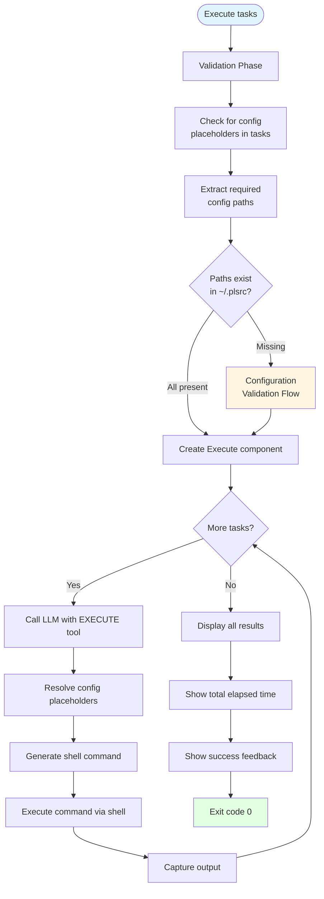
```mermaid
flowchart TD
    Start([Execute tasks]) --> Validate[Validation Phase]

    Validate --> CheckConfig[Check for config<br/>placeholders in tasks]
    CheckConfig --> ExtractPaths[Extract required<br/>config paths]
    ExtractPaths --> CheckExists{Paths exist<br/>in ~/.plsrc?}

    CheckExists -->|Missing| ConfigValFlow[Configuration<br/>Validation Flow]
    CheckExists -->|All present| CreateExec[Create Execute component]

    ConfigValFlow --> CreateExec

    CreateExec --> ExecLoop{More tasks?}
    ExecLoop -->|Yes| CallLLM[Call LLM with EXECUTE tool]
    CallLLM --> ResolveConfig[Resolve config placeholders]
    ResolveConfig --> GenCommand[Generate shell command]
    GenCommand --> RunCommand[Execute command via shell]
    RunCommand --> Capture[Capture output]
    Capture --> ExecLoop

    ExecLoop -->|No| DisplayAll[Display all results]
    DisplayAll --> ShowTime[Show total elapsed time]
    ShowTime --> ShowSuccess[Show success feedback]
    ShowSuccess --> Exit[Exit code 0]

    style Start fill:#e1f5ff
    style ConfigValFlow fill:#fff5e1
    style Exit fill:#e1ffe1
```

**Key Files:**
- src/ui/Execute.tsx
- src/handlers/execute.ts
- src/services/execution-validator.ts
- src/config/EXECUTE.md (LLM instructions)
- src/services/shell.ts (command execution)

**Notes:**
- Tasks execute sequentially, not in parallel
- Each task's output displayed in real-time
- Errors in one task stop execution flow

---

## Configuration Validation Flow

**Trigger:** Execute tasks require config that doesn't exist in ~/.plsrc

**Flow:**

1. Execution validator detects missing config (src/handlers/execution.ts:124)
2. Create Validate component with missing config requirements
   (ComponentName.Validate)
3. Validate component calls LLM with VALIDATE tool (src/ui/Validate.tsx)
4. LLM provides contextual descriptions for each config key:
   - Based on user's original request
   - Based on skill context
   - Human-friendly descriptions
5. Config steps created with descriptions (src/handlers/execution.ts:160-179)
6. Config component displayed with contextual prompts
7. User provides values for missing config
8. Values saved to ~/.plsrc (src/handlers/config.ts:97-165)
9. Success feedback displayed
10. Resume execution with Execute component

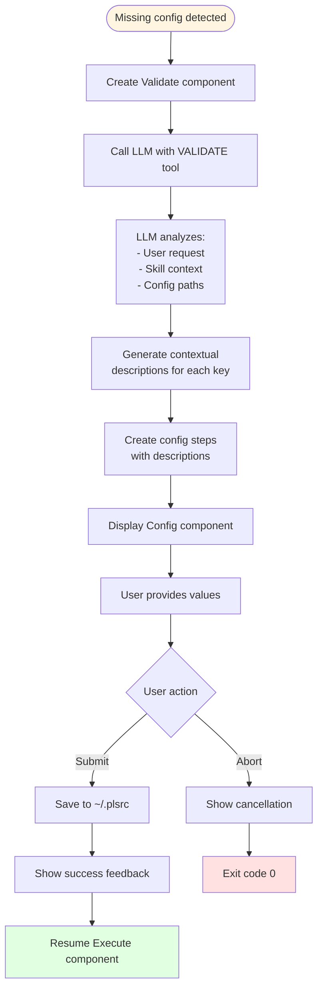
```mermaid
flowchart TD
    Start([Missing config detected]) --> CreateVal[Create Validate component]
    CreateVal --> CallLLM[Call LLM with VALIDATE tool]
    CallLLM --> Analyze[LLM analyzes:<br/>- User request<br/>- Skill context<br/>- Config paths]

    Analyze --> GenDesc[Generate contextual<br/>descriptions for each key]
    GenDesc --> CreateSteps[Create config steps<br/>with descriptions]
    CreateSteps --> DisplayConfig[Display Config component]

    DisplayConfig --> UserInput[User provides values]
    UserInput --> UserAction{User action}

    UserAction -->|Abort| ShowCancel[Show cancellation]
    UserAction -->|Submit| SaveConfig[Save to ~/.plsrc]

    SaveConfig --> ShowSuccess[Show success feedback]
    ShowSuccess --> Resume[Resume Execute component]

    ShowCancel --> Exit[Exit code 0]

    style Start fill:#fff5e1
    style Resume fill:#e1ffe1
    style Exit fill:#ffe1e1
```

**Key Files:**
- src/services/execution-validator.ts (detection)
- src/ui/Validate.tsx (description generation)
- src/handlers/execution.ts:124-226 (flow coordination)
- src/config/VALIDATE.md (LLM instructions)

**Example:**
```
User: "pls build alpha"
Missing config: product.alpha.path
VALIDATE generates: "Product Alpha directory path"
Config prompts user with contextual description
User enters: "/Users/me/projects/alpha"
Saved to ~/.plsrc under product.alpha.path
Execution resumes
```

---

## Skills System Flow

**Trigger:** User creates skills in ~/.pls/skills/ directory

**Purpose:** Extend pls with custom, project-specific workflows

**Flow:**

1. **Skill Loading** (at application start):
   - Skills service scans ~/.pls/skills/ directory
   - Reads all .md files (src/services/skills.ts)
   - Parses each skill file for sections:
     - Name (required)
     - Description (required)
     - Aliases (optional)
     - Config (optional)
     - Steps (required)
     - Execution (optional but recommended)
   - Skills concatenated into "Available Skills" section
   - Appended to PLAN tool instructions

2. **Skill Matching** (during planning):
   - LLM compares user request to skill names and aliases
   - Matches action verbs to skill names
   - If match found → Use skill's execution steps
   - If no match → Create "ignore" task

3. **Skill Execution** (parameter resolution):
   - **Strict placeholders** (e.g., {product.alpha.path}):
     - Direct config lookup in ~/.plsrc
     - No LLM interpretation
   - **Variant placeholders** (e.g., {product.VARIANT.path}):
     - LLM matches user intent to variant name (alpha, beta, etc.)
     - Replaces VARIANT with actual variant in planning
     - Config validator then performs strict lookup
   - **Skill references** (e.g., [Navigate To Product]):
     - Referenced skill's execution steps injected inline
     - Recursive expansion supported
     - Circular references must be prevented

4. **Config Validation** (before execution):
   - Extract all config paths from execution steps
   - Recursively expand skill references
   - Replace VARIANT with matched variant name
   - Check if resolved paths exist in ~/.plsrc
   - If missing → Trigger Configuration Validation Flow

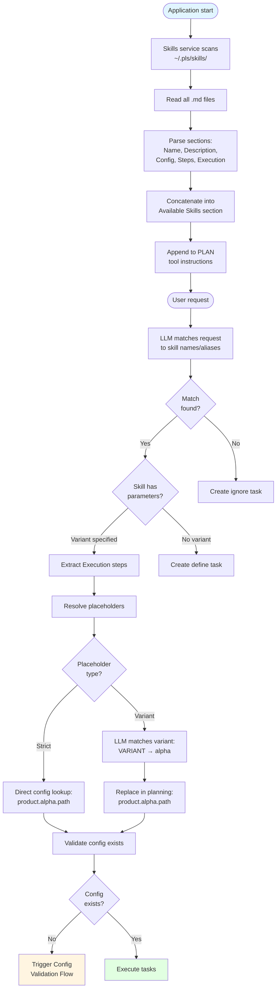
```mermaid
flowchart TD
    Start([Application start]) --> SkillLoad[Skills service scans<br/>~/.pls/skills/]
    SkillLoad --> ReadFiles[Read all .md files]
    ReadFiles --> ParseSections[Parse sections:<br/>Name, Description,<br/>Config, Steps, Execution]
    ParseSections --> Concat[Concatenate into<br/>Available Skills section]
    Concat --> AppendPlan[Append to PLAN<br/>tool instructions]

    AppendPlan --> UserReq([User request])
    UserReq --> SkillMatch[LLM matches request<br/>to skill names/aliases]

    SkillMatch --> Found{Match<br/>found?}
    Found -->|Yes| CheckParams{Skill has<br/>parameters?}
    Found -->|No| CreateIgnore[Create ignore task]

    CheckParams -->|Variant specified| ExtractSteps[Extract Execution steps]
    CheckParams -->|No variant| CreateDefine[Create define task]

    ExtractSteps --> ResolvePlaceholders[Resolve placeholders]
    ResolvePlaceholders --> StrictCheck{Placeholder<br/>type?}

    StrictCheck -->|Strict| DirectLookup[Direct config lookup:<br/>product.alpha.path]
    StrictCheck -->|Variant| LLMMatch[LLM matches variant:<br/>VARIANT → alpha]

    LLMMatch --> ReplaceVar[Replace in planning:<br/>product.alpha.path]
    DirectLookup --> ValidateConfig
    ReplaceVar --> ValidateConfig

    ValidateConfig[Validate config exists] --> ConfigExists{Config<br/>exists?}
    ConfigExists -->|No| TriggerVal[Trigger Config<br/>Validation Flow]
    ConfigExists -->|Yes| Execute[Execute tasks]

    style Start fill:#e1f5ff
    style Execute fill:#e1ffe1
    style TriggerVal fill:#fff5e1
```

**Key Files:**
- src/services/skills.ts (loading and parsing)
- src/config/PLAN.md (skill integration instructions)
- src/services/execution-validator.ts (config validation)
- CLAUDE.md:134-234 (skill definition format)

**Skill File Sections:**

```markdown
### Name
Skill Name Here

### Description
What the skill does and any variants

### Aliases (optional)
- example command
- another way to invoke

### Config (optional)
product:
  alpha:
    path: string
    enabled: boolean

### Steps
- Human-readable step 1
- Human-readable step 2

### Execution
- actual command 1
- actual command 2
- [Referenced Skill Name]
```

**Placeholder Types:**
- `{section.property}` - Strict, direct lookup
- `{section.VARIANT.property}` - Variant resolved by LLM first
- `[Skill Name]` - Inject another skill's execution steps

---

## Error Handling Flow

**Trigger:** Error occurs during any operation

**Flow:**

1. Error caught in component or handler
2. Error transformed to user-friendly message
   (src/services/messages.ts:formatErrorMessage)
3. Current component marked as done
4. Feedback component created with type "failed"
   (ComponentName.Feedback, FeedbackType.Failed)
5. Error message displayed to user
6. Application exits with code 1 (src/services/process.ts)

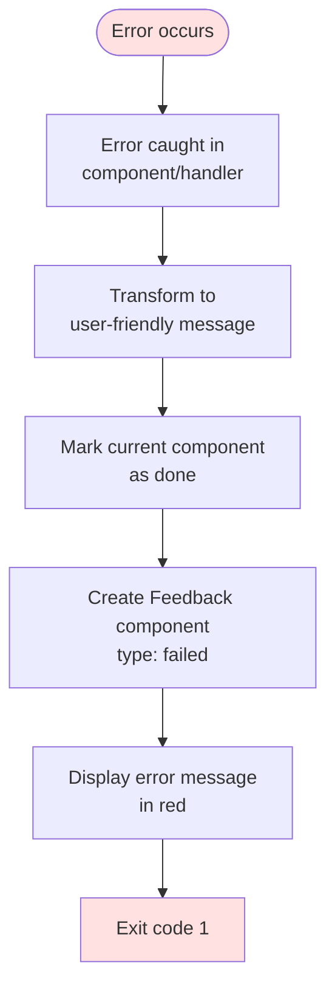
```mermaid
flowchart TD
    Start([Error occurs]) --> Catch[Error caught in<br/>component/handler]
    Catch --> Transform[Transform to<br/>user-friendly message]
    Transform --> MarkDone[Mark current component<br/>as done]
    MarkDone --> CreateFeedback[Create Feedback component<br/>type: failed]
    CreateFeedback --> Display[Display error message<br/>in red]
    Display --> Exit[Exit code 1]

    style Start fill:#ffe1e1
    style Exit fill:#ffe1e1
```

**Error Types:**
- LLM API errors (network, authentication, rate limits)
- Configuration errors (invalid values, missing files)
- Execution errors (command failures, shell errors)
- Validation errors (missing required params)
- Parse errors (invalid LLM responses)

**Key Files:**
- src/services/messages.ts:formatErrorMessage
- src/ui/Feedback.tsx
- src/services/process.ts:exitApp

**User Experience:**
- Clear error message in red
- Technical details only in debug mode
- Exit code 1 for scripting integration

---

## Abort and Cancellation Flow

**Trigger:** User presses Ctrl+C or cancels interactive component

**Flow:**

1. User initiates cancellation:
   - Ctrl+C keyboard shortcut
   - Selecting "No" in confirmation
   - Aborting during selection or input
2. Abort handler called with operation name
   (src/ui/Main.tsx:95-114)
3. Current component marked as done
4. Feedback component created with type "aborted"
   (ComponentName.Feedback, FeedbackType.Aborted)
5. Cancellation message displayed:
   - "Configuration cancelled."
   - "Task selection cancelled."
   - "Request cancelled."
   - "Execution aborted." (with elapsed time)
6. Application exits with code 0

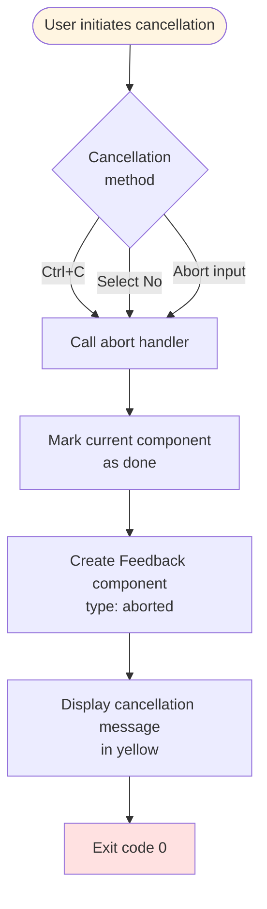
```mermaid
flowchart TD
    Start([User initiates cancellation]) --> Method{Cancellation<br/>method}

    Method -->|Ctrl+C| CallAbort[Call abort handler]
    Method -->|Select No| CallAbort
    Method -->|Abort input| CallAbort

    CallAbort --> MarkDone[Mark current component<br/>as done]
    MarkDone --> CreateFeedback[Create Feedback component<br/>type: aborted]
    CreateFeedback --> ShowMsg[Display cancellation message<br/>in yellow]
    ShowMsg --> Exit[Exit code 0]

    style Start fill:#fff5e1
    style Exit fill:#ffe1e1
```

**Abort Points:**
- Configuration input (Config component)
- Plan selection (Plan component)
- Execution confirmation (Confirm component)
- Command processing (Command component)
- Task execution (Execute component)
- Any interactive component

**Key Files:**
- src/ui/Main.tsx:95-114 (core abort handler)
- src/handlers/* (operation-specific abort handlers)
- src/services/messages.ts:getCancellationMessage

**User Experience:**
- Immediate termination
- Clean feedback message in yellow
- Exit code 0 (user-initiated, not error)

---

## Component Lifecycle

All flows use a queue-based execution model with two arrays:

- **Queue:** Pending component definitions (first item is active)
- **Timeline:** Completed component definitions (visible history)

**Component States:**
- **Stateless:** Move to timeline immediately
  - Welcome, Message, Feedback, Report, AnswerDisplay
- **Stateful:** Wait for completion before moving to timeline
  - Config, Command, Plan, Confirm, Introspect, Answer, Execute, Validate,
    Refinement

**Lifecycle Events:**
1. Component added to queue
2. If stateless → Move to timeline, process next
3. If stateful → Render and wait for completion
4. Component signals completion via callback
   - onFinished, onComplete, onConfirmed, etc.
5. Handler marks component as done (state.done = true)
6. Component moved from queue to timeline
7. Next component in queue becomes active

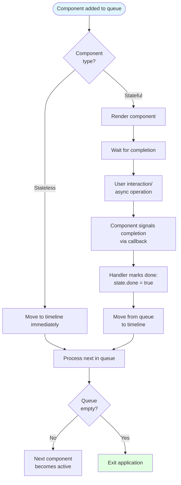
```mermaid
flowchart TD
    Start([Component added to queue]) --> CheckType{Component<br/>type?}

    CheckType -->|Stateless| MoveTimeline[Move to timeline immediately]
    CheckType -->|Stateful| Render[Render component]

    MoveTimeline --> ProcessNext[Process next in queue]

    Render --> WaitComplete[Wait for completion]
    WaitComplete --> UserInteract[User interaction/<br/>async operation]
    UserInteract --> Callback[Component signals completion<br/>via callback]
    Callback --> MarkDone[Handler marks done:<br/>state.done = true]
    MarkDone --> MoveToTimeline[Move from queue<br/>to timeline]
    MoveToTimeline --> ProcessNext

    ProcessNext --> QueueEmpty{Queue<br/>empty?}
    QueueEmpty -->|No| NextActive[Next component<br/>becomes active]
    QueueEmpty -->|Yes| Exit[Exit application]

    style Start fill:#e1f5ff
    style Exit fill:#e1ffe1
```

**Key Interfaces:**
- src/types/components.ts:134-136 (BaseState)
- src/types/components.ts:164-277 (Component definitions)
- src/services/components.ts (factory functions)

---

## Flow Interactions

### Welcome → Config → Command

First-time user experience:
1. No config exists
2. Show Welcome screen
3. Show config required message
4. Config component collects settings
5. If command provided, execute it
6. Otherwise, exit

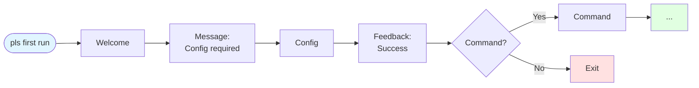
```mermaid
flowchart LR
    Start([pls first run]) --> Welcome[Welcome]
    Welcome --> Message[Message:<br/>Config required]
    Message --> Config[Config]
    Config --> Success[Feedback:<br/>Success]
    Success --> HasCmd{Command?}
    HasCmd -->|Yes| Command[Command]
    HasCmd -->|No| Exit[Exit]
    Command --> Exec[...]

    style Start fill:#e1f5ff
    style Exit fill:#ffe1e1
    style Exec fill:#e1ffe1
```

### Command → Plan → Refinement → Plan → Confirm → Execute

Complex request with ambiguity:
1. User provides ambiguous request
2. Command creates initial plan with DEFINE tasks
3. User selects from options
4. Refinement component shows progress
5. New plan generated with concrete tasks
6. Confirmation prompt
7. Execute tasks sequentially

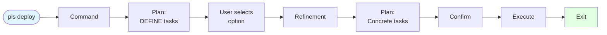
```mermaid
flowchart LR
    Start([pls deploy]) --> Command[Command]
    Command --> Plan1[Plan:<br/>DEFINE tasks]
    Plan1 --> UserSelect[User selects<br/>option]
    UserSelect --> Refine[Refinement]
    Refine --> Plan2[Plan:<br/>Concrete tasks]
    Plan2 --> Confirm[Confirm]
    Confirm --> Execute[Execute]
    Execute --> Exit[Exit]

    style Start fill:#e1f5ff
    style Exit fill:#e1ffe1
```

### Execute → Validate → Config → Execute

Missing configuration during execution:
1. Execute tasks require config
2. Validator detects missing paths
3. Validate generates contextual descriptions
4. Config prompts for missing values
5. Values saved to ~/.plsrc
6. Execute resumes with complete config

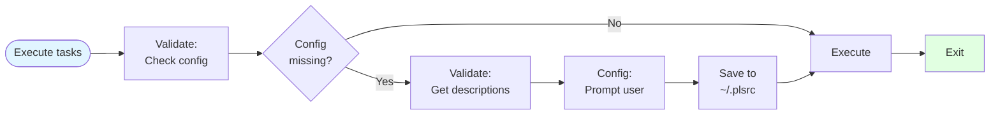
```mermaid
flowchart LR
    Start([Execute tasks]) --> Validate[Validate:<br/>Check config]
    Validate --> Missing{Config<br/>missing?}
    Missing -->|Yes| ValComp[Validate:<br/>Get descriptions]
    Missing -->|No| Execute[Execute]
    ValComp --> Config[Config:<br/>Prompt user]
    Config --> Save[Save to<br/>~/.plsrc]
    Save --> Execute
    Execute --> Exit[Exit]

    style Start fill:#e1f5ff
    style Exit fill:#e1ffe1
```

---

## Debug Mode

**Toggle:** Shift+Tab (global keyboard shortcut)

**Effects:**
- Displays internal component state
- Shows component IDs and queue position
- Reveals task parameters and metadata
- Persisted to ~/.plsrc (debug setting)

**Key Files:**
- src/ui/Main.tsx:65-72 (keyboard handler)
- src/services/keyboard.ts (shortcut registration)
- src/services/configuration.ts (persistence)

---

## Exit Conditions

**Success Exit (code 0):**
- Queue empty and timeline has content
- User cancels operation (abort)
- Configuration completed without command

**Error Exit (code 1):**
- LLM API error
- Command execution failure
- Invalid configuration
- Parse error
- Service not available

**Exit Handler:**
- src/services/process.ts:exitApp
- Ensures clean termination
- Sets appropriate exit code

---

## Overall System Architecture

This diagram shows how all the major flows connect together in the pls system:

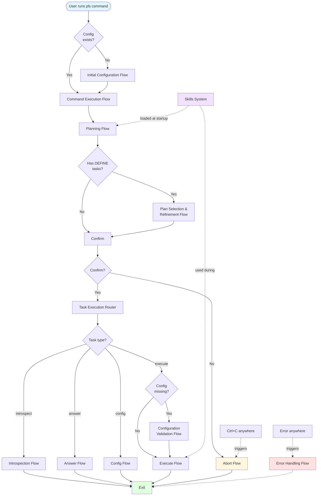
```mermaid
flowchart TD
    Start([User runs pls command]) --> ConfigCheck{Config<br/>exists?}

    ConfigCheck -->|No| InitConfig[Initial Configuration Flow]
    ConfigCheck -->|Yes| CommandFlow[Command Execution Flow]

    InitConfig --> CommandFlow

    CommandFlow --> PlanFlow[Planning Flow]
    PlanFlow --> HasDefine{Has DEFINE<br/>tasks?}

    HasDefine -->|Yes| SelectRefine[Plan Selection &<br/>Refinement Flow]
    HasDefine -->|No| ConfirmFlow[Confirm]

    SelectRefine --> ConfirmFlow
    ConfirmFlow --> UserConfirm{Confirm?}

    UserConfirm -->|No| Abort[Abort Flow]
    UserConfirm -->|Yes| Router[Task Execution Router]

    Router --> TypeCheck{Task type?}

    TypeCheck -->|introspect| Introspect[Introspection Flow]
    TypeCheck -->|answer| Answer[Answer Flow]
    TypeCheck -->|config| ConfigExec[Config Flow]
    TypeCheck -->|execute| ExecuteCheck{Config<br/>missing?}

    ExecuteCheck -->|Yes| ConfigVal[Configuration<br/>Validation Flow]
    ExecuteCheck -->|No| Execute[Execute Flow]

    ConfigVal --> Execute

    Introspect --> Exit
    Answer --> Exit
    ConfigExec --> Exit
    Execute --> Exit
    Abort --> Exit[Exit]

    ErrorAny[Error anywhere] -.->|triggers| ErrorFlow[Error Handling Flow]
    ErrorFlow -.-> Exit

    AbortAny[Ctrl+C anywhere] -.->|triggers| Abort

    SkillSystem[Skills System]
    SkillSystem -.->|loaded at startup| PlanFlow
    SkillSystem -.->|used during| Execute

    style Start fill:#e1f5ff
    style Exit fill:#e1ffe1
    style ErrorFlow fill:#ffe1e1
    style Abort fill:#fff5e1
    style SkillSystem fill:#f0e1ff
```

## Summary

The pls concierge supports these core workflows:

1. **Initial Configuration** - First-time setup with Anthropic API
2. **Command Execution** - Natural language to structured tasks
3. **Planning** - LLM-based request interpretation and task generation
4. **Plan Selection** - Interactive disambiguation for ambiguous requests
5. **Task Execution** - Type-specific handlers (introspect, answer, config,
   execute)
6. **Configuration Validation** - Automatic detection and prompting for missing
   config
7. **Skills System** - User-defined workflows with parameter resolution
8. **Error Handling** - User-friendly errors with appropriate exit codes
9. **Abort/Cancellation** - Clean termination at any interaction point

All flows follow a queue-based component lifecycle, maintaining a visible
timeline of completed interactions while processing the current component.
The architecture ensures clean separation between stateless display components
and stateful interactive components, with consistent error handling and
cancellation support throughout.
