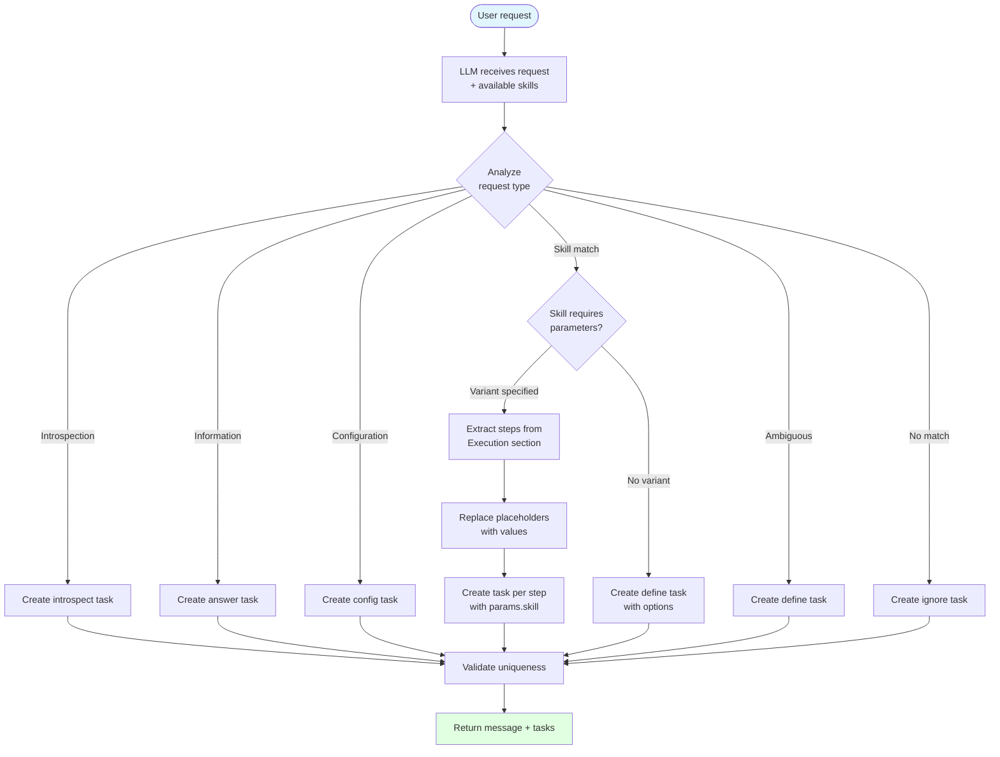

# Supported Flows

This document provides a comprehensive overview of all user workflows supported
by the pls (prompt-language-shell) command-line concierge.

## Table of Contents

1. [Initial Configuration Flow](#initial-configuration-flow)
2. [Command Execution Flow](#command-execution-flow)
3. [Scheduling Flow](#scheduling-flow)
4. [Schedule Selection and Refinement Flow](#schedule-selection-and-refinement-flow)
5. [Task Execution Flows](#task-execution-flows)
6. [Configuration Validation Flow](#configuration-validation-flow)
7. [Skills System Flow](#skills-system-flow)
8. [Error Handling Flow](#error-handling-flow)
9. [Abort and Cancellation Flow](#abort-and-cancellation-flow)

---

## Initial Configuration Flow

**Trigger:** User runs `pls` for the first time or configuration is missing

**Flow:**

1. Application starts
2. Main component checks for valid Anthropic API key
3. If no valid configuration exists:
   - Display welcome screen
   - Show configuration required message
   - Display configuration component
4. User provides configuration values:
   - Anthropic API key
   - Model selection (with validation)
5. Configuration is saved to ~/.plsrc
6. AnthropicService is created with new configuration
7. Success feedback is displayed
8. If command was provided, proceed to command execution
9. Otherwise, exit gracefully


---

## Command Execution Flow

**Trigger:** User runs `pls <command>` or completes initial configuration

**Flow:**

1. User provides natural language command
2. Main component creates Command definition
3. Command component calls LLM with SCHEDULE tool
4. LLM processes request and returns:
   - Message introducing the schedule
   - List of structured tasks with actions, types, and parameters
5. Command handler receives response
6. Handler analyzes task list:
   - If contains DEFINE tasks → Show schedule and await user selection
   - If all tasks are concrete → Show schedule with confirmation
7. Proceed to appropriate next flow


---

## Scheduling Flow

**Trigger:** Command component processes user request

**Purpose:** Transform natural language into structured task definitions

**Flow:**

1. LLM receives user request and available skills (if any)
2. LLM analyzes request type:
   - **Introspection request** → Create task with type "introspect"
   - **Information request** → Create task with type "answer"
   - **Configuration request** → Create task with type "config"
   - **Skill-based request** → Match to available skills
   - **Ambiguous request** → Create task with type "define"
   - **Unmatched request** → Create task with type "ignore"
3. For skill-based requests:
   - Check if skill requires parameters (e.g., {TARGET}, {ENV})
   - If variant specified → Extract steps from skill's Execution section
   - If variant not specified → Create "define" task with options
   - Replace all placeholders with actual values
   - Create task for each step with params.skill and params.variant
4. LLM returns structured response:
   - Introductory message (max 64 chars, ends with period)
   - Array of task definitions with action, type, and params
5. Tasks validated for uniqueness and clarity



**Task Types:**

- `config` - Configuration changes, settings updates
- `schedule` - Planning or breaking down tasks
- `execute` - Shell commands, running programs, processing operations
- `answer` - Answering questions, providing information
- `introspect` - Listing capabilities and skills
- `report` - Generating summaries, displaying results
- `define` - Presenting options when request is ambiguous
- `ignore` - Request too vague or no matching skill
- `select` - User selection from options
- `discard` - Tasks to be discarded
- `group` - Hierarchical container for organizing related subtasks

**CONFIGURE Tool Delegation:**

When the SCHEDULE tool returns tasks that are all of type `configure`, the Command
component automatically delegates to the CONFIGURE tool for refined configuration
key extraction. This two-phase approach ensures specific, contextual config
prompts:

1. **Phase 1 (SCHEDULE):** Identifies request as configuration-related and returns
   generic config tasks
2. **Phase 2 (CONFIGURE):** Takes the config query (from first task's params or
   defaults to 'app') and returns specific config keys with validation rules

**Example:**

```
User request: "configure my API settings"
SCHEDULE returns: [{ type: "configure", params: { query: "api" } }]
CONFIGURE delegation: processWithTool("api", "configure")
CONFIGURE returns: [{ type: "configure", params: { keys: ["api.endpoint", "api.key"] } }]
```

This delegation happens transparently in the Command component before the schedule
is shown to the user, ensuring they see the final, specific configuration
requirements rather than generic placeholders.

---

## Schedule Selection and Refinement Flow

**Trigger:** Schedule contains one or more DEFINE tasks

**Flow:**

1. Schedule component displays DEFINE task(s)
2. User navigates options using keyboard:
   - Up/Down arrows to highlight options
   - Enter to select highlighted option
   - Ctrl+C to abort
3. User selects an option for each DEFINE task
4. Refinement component shows "refining schedule" message
5. Selected tasks sent to LLM for schedule refinement
6. LLM generates refined schedule with concrete tasks
7. New schedule displayed with confirmation prompt
8. User confirms or cancels execution


---

## Task Execution Flows

### Overview

After schedule confirmation, tasks are routed to appropriate handlers based on type.

**Routing Logic:**

1. Confirm component completes
2. Execution handler analyzes task types:
   - All introspect → Introspection flow
   - All answer → Answer flow
   - All config → Config flow
   - All execute → Execute flow (with optional validation)
   - Mixed types → Error (not supported)
3. Route to appropriate handler


---

### Introspection Flow

**Trigger:** All tasks have type "introspect"

**Flow:**

1. Create Introspect component
2. Component calls LLM with INTROSPECT tool
3. LLM analyzes available capabilities:
   - Built-in capabilities (introspect, answer, config, execute)
   - User-defined skills from ~/.pls/skills/
4. LLM generates:
   - Introductory message
   - List of capabilities with descriptions
   - Marks built-in vs user-defined skills
5. Report component displays results
6. Application exits


---

### Answer Flow

**Trigger:** All tasks have type "answer"

**Flow:**

1. Extract question from first task's action field
2. Create Answer component
3. Component performs web search for the question
4. Search results analyzed and answer synthesized
5. Answer displayed
6. Application exits


---

### Config Flow

**Trigger:** All tasks have type "config"

**Flow:**

1. Extract config keys from task parameters
2. Create Config component with required keys
3. User provides values for each configuration key:
   - Text input for most fields
   - Validation applied per field
4. Config component collects all values
5. Values saved to appropriate section in ~/.plsrc
6. Success feedback displayed
7. If part of execution flow, resume with Execute component
8. Otherwise, exit


**Configuration Structure:**

- Nested YAML in ~/.plsrc
- Grouped by top-level sections
- Supports dot-notation paths (e.g., product.alpha.path)

---

### Execute Flow

**Trigger:** All tasks have type "execute"

**Flow:**

1. **Validation Phase:**
   - Validator checks tasks for config placeholders
   - Extracts required config paths from task actions
   - Checks if paths exist in ~/.plsrc
   - If missing config found → Configuration Validation Flow
   - If all config present → Continue to execution

2. **Execution Phase:**
   - Create Execute component
   - For each task sequentially:
     - Call LLM with EXECUTE tool
     - LLM resolves config placeholders
     - LLM generates shell command
     - Command executed via shell service
     - Output captured and displayed
   - Collect all outputs and elapsed time

3. **Completion:**
   - All task results displayed
   - Total execution time shown
   - Success feedback
   - Application exits


---

## Configuration Validation Flow

**Trigger:** Execute tasks require config that doesn't exist in ~/.plsrc

**Flow:**

1. Execution validator detects missing config
2. Create Validate component with missing config requirements
3. Validate component calls LLM with VALIDATE tool
4. LLM provides contextual descriptions for each config key:
   - Based on user's original request
   - Based on skill context
   - Human-friendly descriptions
5. Config steps created with descriptions
6. Validation message displayed (e.g., "Missing configuration values
   detected. Let me gather them now.")
7. Config component displayed
8. User provides values for missing config
9. Values saved to ~/.plsrc
10. Success feedback displayed
11. Execute resumes with fresh configuration


**Example:**

```
User: "pls build alpha"
Missing config: product.alpha.path
VALIDATE generates: "Product Alpha directory path"
Config prompts user with contextual description
User enters: "/Users/me/projects/alpha"
Saved to ~/.plsrc under product.alpha.path
Execution resumes
```

---

## Skills System Flow

**Trigger:** User creates skills in ~/.pls/skills/ directory

**Purpose:** Extend pls with custom, project-specific workflows

**Flow:**

1. **Skill Loading** (at application start):
   - Skills service scans ~/.pls/skills/ directory
   - Reads all .md files
   - Parses each skill file for sections:
     - Name (required)
     - Description (required)
     - Aliases (optional)
     - Config (optional)
     - Steps (required)
     - Execution (optional but recommended)
   - Skills concatenated into "Available Skills" section
   - Appended to SCHEDULE tool instructions

2. **Skill Matching** (during schedulening):
   - LLM compares user request to skill names and aliases
   - Matches action verbs to skill names
   - If match found → Use skill's execution steps
   - If no match → Create "ignore" task

3. **Skill Execution** (parameter resolution):
   - **Strict placeholders** (e.g., {product.alpha.path}):
     - Direct config lookup in ~/.plsrc
     - No LLM interpretation
   - **Variant placeholders** (e.g., {product.VARIANT.path}):
     - LLM matches user intent to variant name (alpha, beta, etc.)
     - Replaces VARIANT with actual variant in schedulening
     - Config validator then performs strict lookup
   - **Skill references** (e.g., [Navigate To Product]):
     - Referenced skill's execution steps injected inline
     - Recursive expansion supported
     - Circular references must be prevented

4. **Config Validation** (before execution):
   - Extract all config paths from execution steps
   - Recursively expand skill references
   - Replace VARIANT with matched variant name
   - Check if resolved paths exist in ~/.plsrc
   - If missing → Trigger Configuration Validation Flow


**Placeholder Types:**

- `{section.property}` - Strict, direct lookup
- `{section.VARIANT.property}` - Variant resolved by LLM first
- `[Skill Name]` - Inject another skill's execution steps

---

## Error Handling Flow

**Trigger:** Error occurs during any operation

**Flow:**

1. Error caught in component or handler
2. Error transformed to user-friendly message
3. Current component marked as done
4. Feedback component created with type "failed"
5. Error message displayed to user
6. Application exits with code 1


**Error Types:**

- LLM API errors (network, authentication, rate limits)
- Configuration errors (invalid values, missing files)
- Execution errors (command failures, shell errors)
- Validation errors (missing required params)
- Parse errors (invalid LLM responses)

---

## Abort and Cancellation Flow

**Trigger:** User presses Ctrl+C or cancels interactive component

**Flow:**

1. User initiates cancellation:
   - Ctrl+C keyboard shortcut
   - Selecting "No" in confirmation
   - Aborting during selection or input
2. Abort handler called with operation name
3. Current component marked as done
4. Feedback component created with type "aborted"
5. Cancellation message displayed (varies randomly):
   - "I've cancelled the [operation]."
   - "I've aborted the [operation]."
   - "The [operation] was cancelled."
   - "The [operation] has been aborted."
6. Application exits with code 0


**Abort Points:**

- Configuration input
- Plan selection
- Execution confirmation
- Command processing
- Task execution
- Any interactive component

---

## Component Lifecycle

All flows use a queue-based execution model with four states:

- **Queued:** Pending component definitions waiting in queue
- **Active:** Currently executing component (first item in queue)
- **Pending:** Parked component awaiting subsequent interaction
- **Timeline:** Completed component definitions (visible history)

**Component States:**

- **Stateless:** Move to timeline immediately
  - Welcome, Message, Feedback, Report, Debug
- **Stateful:** Wait for completion before moving to timeline
  - Config, Command, Schedule, Confirm, Introspect, Answer, Execute, Validate,
    Refinement

**Lifecycle Events:**

1. Component added to queue
2. If stateless → Move to timeline, process next
3. If stateful → Render and wait for completion
4. Component signals completion via callback
5. Handler marks component as done
6. Component moved from queue to timeline
7. Next component in queue becomes active


---

## Flow Interactions

### Welcome → Config → Command

First-time user experience:

1. No config exists
2. Show Welcome screen
3. Show config required message
4. Config component collects settings
5. If command provided, execute it
6. Otherwise, exit


### Command → Schedule → Refinement → Schedule → Confirm → Execute

Complex request with ambiguity:

1. User provides ambiguous request
2. Command creates initial schedule with DEFINE tasks
3. User selects from options
4. Refinement component shows progress
5. New schedule generated with concrete tasks
6. Confirmation prompt
7. Execute tasks sequentially


### Execute → Validate → Config → Execute

Missing configuration during execution:

1. Execute tasks require config
2. Validator detects missing paths
3. Validate generates contextual descriptions
4. Validation message added to timeline
5. Config prompts for missing values
6. Values saved to ~/.plsrc
7. After save, Execute component added to queue
8. Execute runs with complete config


---

## Overall System Architecture

This diagram shows how all the major flows connect together in the pls system:


## Summary

The pls concierge supports these core workflows:

1. **Initial Configuration** - First-time setup with Anthropic API
2. **Command Execution** - Natural language to structured tasks
3. **Planning** - LLM-based request interpretation and task generation
4. **Plan Selection** - Interactive disambiguation for ambiguous requests
5. **Task Execution** - Type-specific handlers (introspect, answer, config,
   execute)
6. **Configuration Validation** - Automatic detection and prompting for missing
   config
7. **Skills System** - User-defined workflows with parameter resolution
8. **Error Handling** - User-friendly errors with appropriate exit codes
9. **Abort/Cancellation** - Clean termination at any interaction point

All flows follow a queue-based component lifecycle, maintaining a visible
timeline of completed interactions while processing the current component.
The architecture ensures clean separation between stateless display components
and stateful interactive components, with consistent error handling and
cancellation support throughout.
